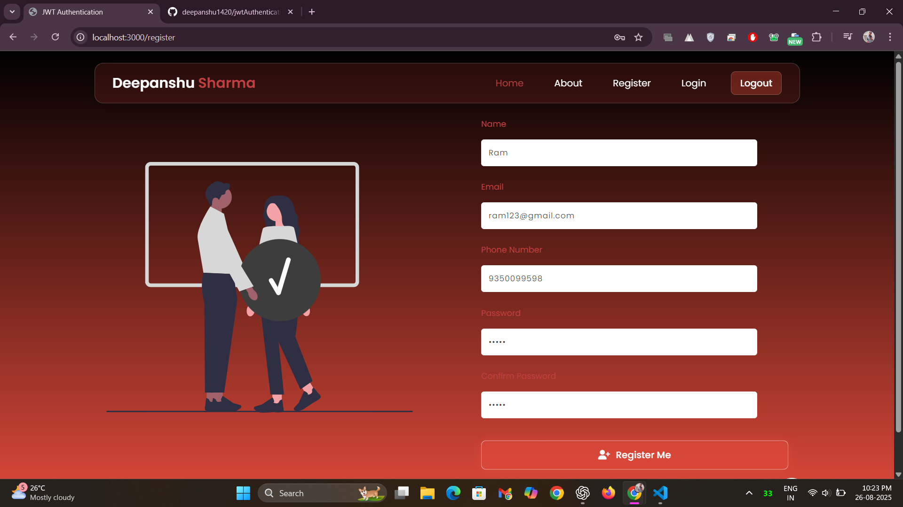
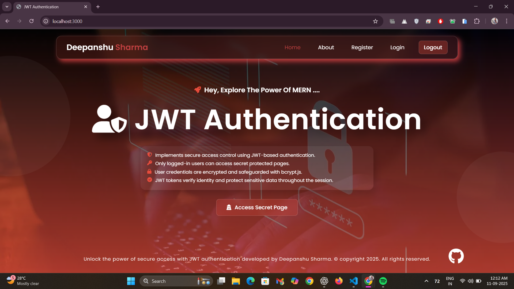
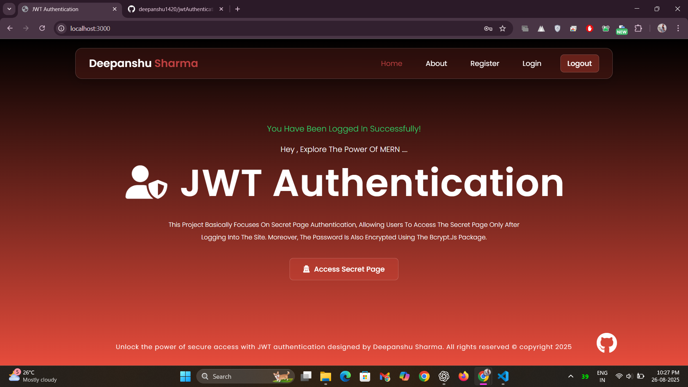
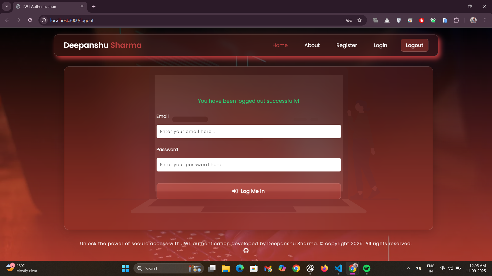
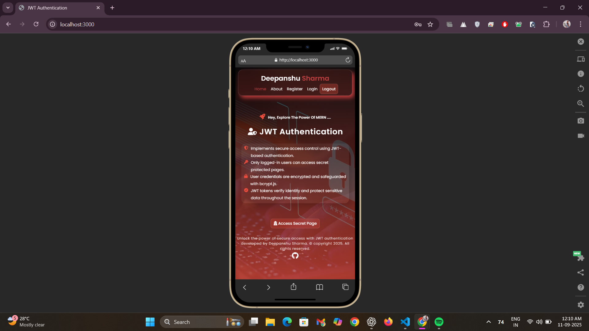
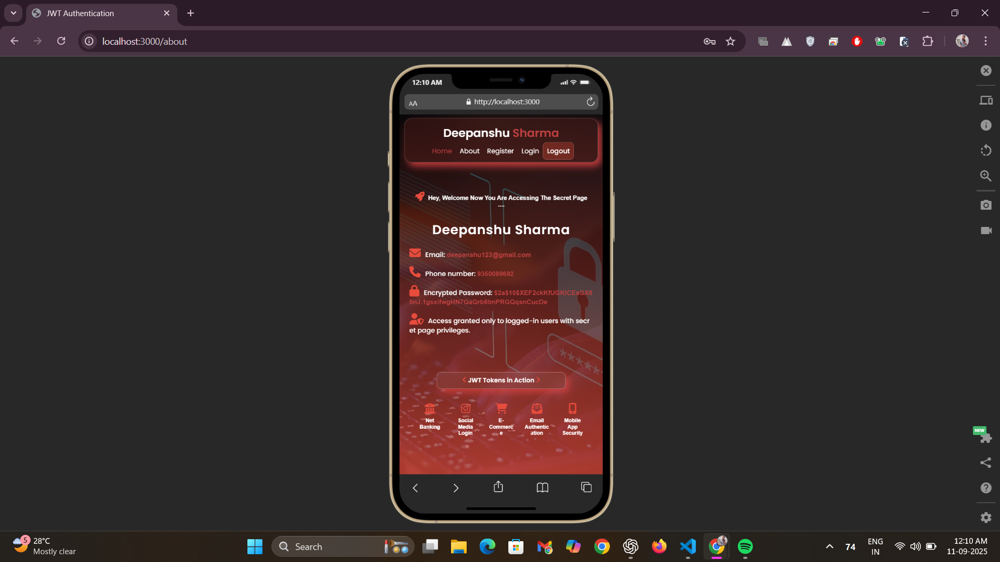

# 🔐 JWT Authentication

[](https://www.mongodb.com/mern-stack) [](https://nodejs.org/) [](https://expressjs.com/) [](https://www.mongodb.com/) [](https://handlebarsjs.com/) [](https://jwt.io/) [](https://www.npmjs.com/package/bcryptjs) [](https://www.npmjs.com/package/validator) [](https://www.npmjs.com/package/dotenv) [](https://www.npmjs.com/package/nodemon) [](https://developer.mozilla.org/en-US/docs/Web/JavaScript) [](LICENSE)

**This project demonstrates a secure authentication system using Node.js, Express.js, MongoDB and JWTs for session management. Users can register, login, access protected routes and logout safely.**

**🌐 Unlock the Power of JWT Authentication :** [Live Demo](https://jwtauth-secure.vercel.app/)

## 🌟 Overview

A secure server-rendered authentication system built with Node.js and Express. It leverages JWT tokens for session management, bcrypt.js for password hashing and MongoDB (via Mongoose) for storing user data. Handlebars.js (hbs) is used for dynamic server-side rendering of pages.  

**Important Notes:**  

- 🔐 JWTs are used to protect sensitive routes.  
- 🛡️ Passwords are securely hashed with bcrypt.js node package.  
- ⚙️ Environment variables are stored in `.env` file.  
- 🌐 Fast internet required for smooth rendering and DB access, slow connection may cause login issues.

## 🔐 So, What is JWT?

- 🔐 JWT (JSON Web Token) is a `stateless token-based mechanism` used for secure user authentication.
- 📱 Commonly used in Instagram login systems, banking applications, secure dashboards and modern web APIs.
- 🛡️ Helps applications verify trusted users and protect private routes from unauthorized access.
- ⚡ Eliminates the need for traditional server-side session storage, making applications faster and scalable.

**Structure of JWT:**

- 🧾 **Header** → Contains token type (`JWT`) and signing algorithm like `HS256`
- 📦 **Payload** → Stores user-related data like user ID, email and roles
- ✍️ **Signature** → Verifies token authenticity and prevents token tampering

## ⚙️ How JWT Authentication Works?

- **1️⃣ User Login** → User logs in using credentials, server generates an Access Token (JWT) & a Refresh Token 🔐  
- **2️⃣ Token Storage** → Tokens are securely stored in browser cookies or local/session storage 🍪  
- **3️⃣ Authorized Requests** → User sends JWT in the Authorization header with future requests 📩  
- **4️⃣ Token Verification** → Server verifies JWT signature using its secret key before granting access ✅  
- **5️⃣ Access Token Expiry** → If access token expires, refresh token generates a new JWT automatically ♻️
- **6️⃣ Access Granted** → If token is valid, user gets access to protected routes and resources 🛡️
- **7️⃣ Access Denied** → Invalid or expired JWT immediately blocks unauthorized access ❌   
- **8️⃣ Secure Logout** → JWT tokens are cleared from cookies, safely ending the user session 🚪 

## ✅ Advantages

- **🔒 Highly Secure:** JWT is modern, widely used in netbanking apps and popular platforms to secure data.  
- **📦 Stateless Sessions:** No server-side session storage required, reducing server load.  
- **🛠️ Tamper-Proof:** Tokens are digitally signed, protecting data from hackers. 
- **🔑 HS256 Security:** HS256 (HMAC-SHA256) securely signs and verifies JWT tokens.   
- **🌍 Scalable:** Easy to use in distributed systems and large-scale applications.  

## 📸 Screenshots / Demo

### 📝 Register
  
*User registration form with validation and password hashing.*

### 🏠 Home (Before Login)
  
*Landing page showing available actions and navigation.*

### 🔐 Login
  
*Login form requesting email and password.*

### ✅ Login Success
  
*JWT token generated and stored in cookies upon successful login.*

### 🛡️ Secret Page (Protected Route)
  
*Access granted only with a valid JWT token.*

### 🚪 Logout
  
*JWT cleared from cookies, ending user session securely.*

### 📱 Mobile View (HomePage)
  
*Responsive layout using CSS flex/grid, optimized navigation and content display for smaller screens.*

### 📲 Mobile View (Secret Page)
  
*Protected page adapts to mobile viewports, ensuring secure content access and usability on handheld devices.*

## 🛠 Tech Stack Used

### 1️⃣ Core Technologies

- **🌐 MERN Stack:** MongoDB, Express.js, React.js (optional frontend), Node.js  
- **🚀 Runtime Environment:** Node.js (Executes server-side JavaScript)  
- **🧩 Web Framework:** Express.js (Handles routing, middleware and server structure) 
- **🗄️ Database:** MongoDB with Mongoose (NoSQL database storing user data with schema-based modeling)  
- **📄 Templating Engine:** Handlebars.js `.hbs` (Dynamically renders HTML pages server-side) 
- **💡 Modern JavaScript (ES6+):** Uses arrow functions, modules, async/await and destructuring for cleaner code. 

### 2️⃣ Authentication & Security

- **🔑 JWT (jsonwebtoken):** Manages secure, stateless user sessions.  
- **🧠 Bcrypt.js:** Hashes and verifies passwords.  
- **🛡️ Validator.js:** Validates and sanitizes user input for security.  

### 3️⃣ Utility & Development Tools

- **⚙️ Environment Variables:** dotenv (Loads secrets like DB URIs and JWT keys) 
- **🍪 Cookie Management:** cookie-parser (Parses cookies for JWT storage) 
- **🧪 Development Workflow:** Nodemon (Auto-restarts server on code changes) 

## 🛠️ Setup and Installation

Follow these steps to run the project locally on your machine:

### 1️⃣ Clone the Repository

```bash
git clone https://github.com/deepanshu1420/jwtAuthentication.git
cd jwtAuthentication
```

### 2️⃣ Install Dependencies

Make sure you have **Node.js** installed, then run:

```bash
npm install
```

### 3️⃣ Start the Development Server

```bash
npm run dev
```

### 4️⃣ Open the Application

Open your browser and visit:

```bash
http://localhost:3000
```

The app should now be running locally 🚀

