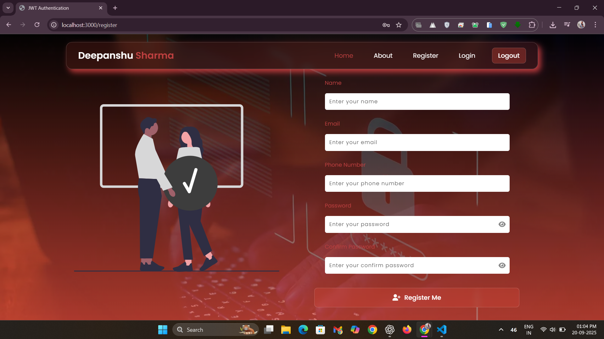
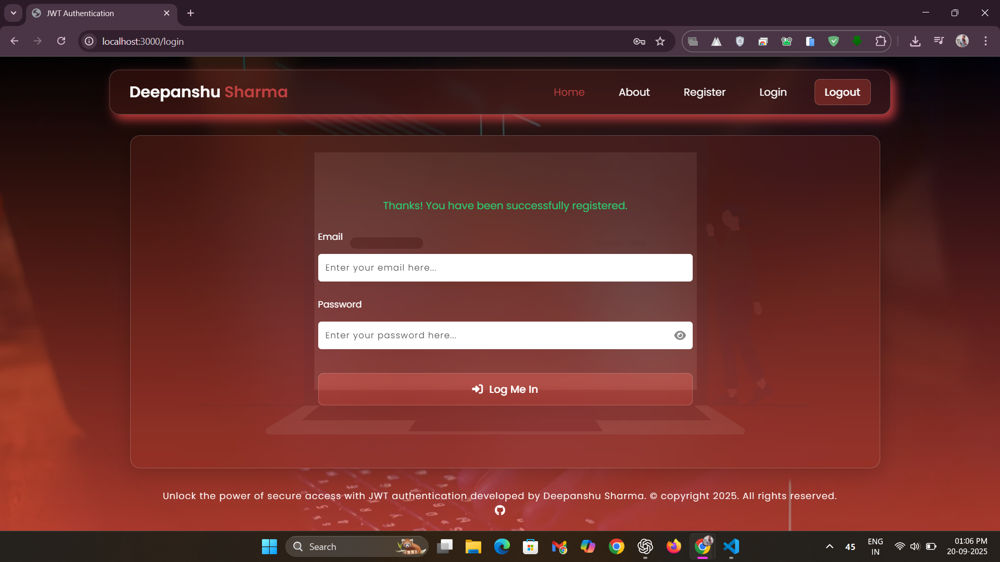

# 🔐 JWT Authentication

[](https://www.mongodb.com/mern-stack) [](https://nodejs.org/) [](https://expressjs.com/) [](https://www.mongodb.com/) [](https://handlebarsjs.com/) [](https://jwt.io/) [](https://www.npmjs.com/package/bcryptjs) [](https://www.npmjs.com/package/validator) [](https://www.npmjs.com/package/dotenv) [](https://www.npmjs.com/package/nodemon) [](https://developer.mozilla.org/en-US/docs/Web/JavaScript) [](LICENSE)

**This project demonstrates a secure authentication system using Node.js, Express.js, MongoDB, and JWTs for session management. Users can register, login, access protected routes, and logout safely.**

---

## 🌟 Overview

A secure, server-rendered authentication system built with Node.js and Express. It leverages JWT tokens for session management, bcrypt for password hashing, and MongoDB (via Mongoose) for storing user data. Handlebars.js (hbs) is used for dynamic server-side rendering of pages.  

**Important Notes:**  
- JWTs are used to protect sensitive routes.  
- Passwords are securely hashed with bcrypt.  
- Environment variables are stored in a `.env` file.  

---

## ⚡ Features

- **User Registration** – Sign up with email and password, validated and hashed.  
- **User Login** – Authenticate users and issue JWT tokens.  
- **Protected Routes** – Access restricted pages only if logged in.  
- **Logout** – Safely terminate session by clearing JWT.  
- **Server-Side Rendering** – Pages rendered using Handlebars templates.  

---

## 🛠 Tech Stack

### Core Technologies
- **MERN Stack:** MongoDB, Express.js, React (optional frontend), Node.js  
- **Runtime Environment:** Node.js – Executes server-side JavaScript.  
- **Web Framework:** Express.js – Handles routing, middleware, and server structure.  
- **Database:** MongoDB with Mongoose – NoSQL database storing user data with schema-based modeling.  
- **Templating Engine:** Handlebars.js (hbs) – Dynamically renders HTML pages server-side. 
- **Modern JavaScript (ES6+):** Uses arrow functions, modules, async/await, destructuring, and template literals for cleaner, efficient code. 

### Authentication & Security
- **JWT (jsonwebtoken):** Manages secure, stateless user sessions.  
- **Bcrypt.js:** Hashes and verifies passwords.  
- **Validator.js:** Validates and sanitizes user input for security.  

### Utility & Development Tools
- **Environment Variables:** dotenv – Loads secrets like DB URIs and JWT keys.  
- **Cookie Management:** cookie-parser – Parses cookies for JWT storage.  
- **Development Workflow:** Nodemon – Auto-restarts server on code changes.  

### ✅ Advantages
- **Highly Secure:** JWT is modern, widely used in netbanking apps and popular platforms to secure data.  
- **Stateless Sessions:** No server-side session storage required, reducing server load.  
- **Tamper-Proof:** Tokens are digitally signed, protecting data from hackers.  
- **Scalable:** Easy to use in distributed systems and large-scale applications.  

---

## 📸 Stepwise Screenshots

### 1. Register
  
*User registration form with validation and password hashing.*

### 2. Home (Before Login)
  
*Landing page showing available actions and navigation.*

### 3. Login
  
*Login form requesting email and password.*

### 4. Login Success
  
*JWT token generated and stored in cookies upon successful login.*

### 5. Secret Page (Protected Route)
  
*Access granted only with a valid JWT token.*

### 6. Logout
  
*JWT cleared from cookies, ending user session securely.*

---

## ⚡ Installation

```bash
# 1. Clone the repository
git clone <your-repo-link>

# 2. Navigate to the project folder
cd jwtAuthentication

# 3. Install dependencies
npm install

# 4. Start the development server
npm run dev
